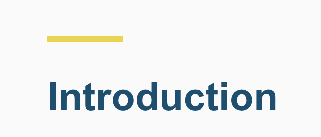
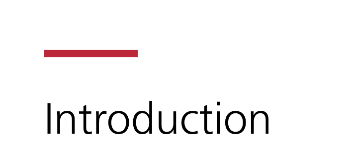
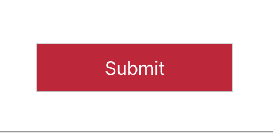
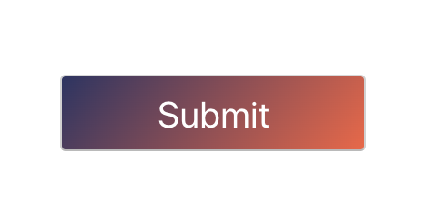
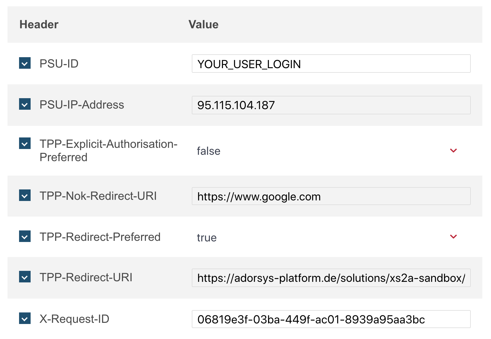
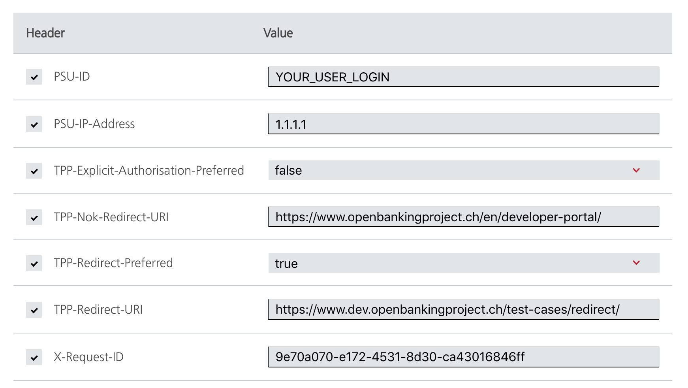
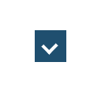
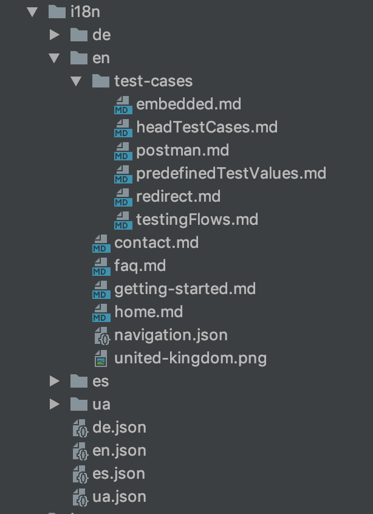
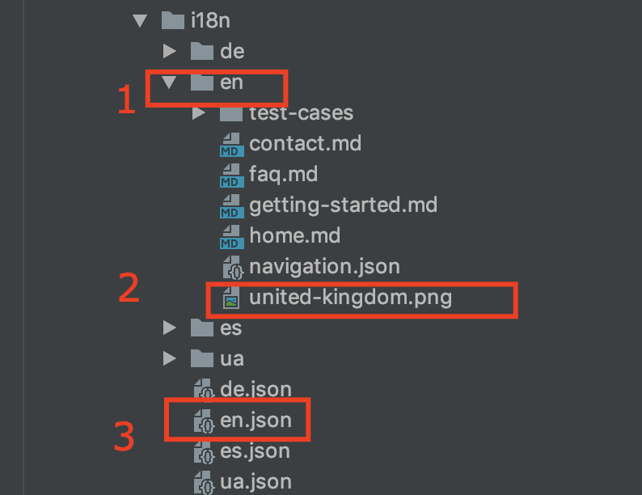

# UI Customization guide

## Table of content

1. [General information about UIs customization](#general-information-about-uis-customization)

    1.1 [General information](#general-information)

    1.2 [Step-by-step guide](#step-by-step-guide)

    1.3 [Common CSS properties](#common-css-properties)

    - [Fonts](#fonts)
    - [Text sizes and weights for different screen sizes](#text-sizes-and-weights-for-different-screen-sizes)
    - [Headers sizes and weights for different screen sizes](#headers-sizes-and-weights)
    - [Colors](#colors)
    - [HTML Body settings](#html-body-settings)
    - [Navigation bar colors](#navigation-bar-colors)
    - [Footer colors](#footer-colors)
    - [Anchor colors](#anchor-colors)
    - [Buttons](#buttons)
    - [Inputs](#inputs)
    - [Selects](#selects)

        1.4 [Examples](#examples)

    - [Examples of font customization](#examples-of-font-customization)
    - [Examples of text size customization](#examples-of-text-size-customization)
    - [Examples of text weight customization](#examples-of-text-weight-customization)
    - [Examples of h1 size customization](#examples-of-h1-size-customization)
    - [Examples of h1 weight customization](#examples-of-h1-weight-customization)
    - [Examples of h2 size customization](#examples-of-h2-size-customization)
    - [Examples of h2 weight customization](#examples-of-h2-weight-customization)
    - [Examples of h3 size customization](#examples-of-h3-size-customization)
    - [Examples of h3 weight customization](#examples-of-h3-weight-customization)
    - [Examples of color customization](#examples-of-color-customization)
    - [Examples of html body customization](#examples-of-html-body-customization)
    - [Examples of navigation bar customization](#examples-of-navigation-bar-customization)
    - [Examples of footer customization](#examples-of-footer-customization)
    - [Examples of anchor customization](#examples-of-anchor-customization)
    - [Examples of button customization](#examples-of-button-customization)
    - [Examples of input customization](#examples-of-input-customization)
    - [Examples of select customization ](#examples-of-select-customization)

2. [How to customize Developer Portal](#how-to-customize-developer-portal)

    2.1 [Details about Developer Portal customization](#details-about-developer-portal-customization)

    2.2 [Additional CSS properties for Developer Portal](#additional-css-properties-for-developer-portal)

    - [Main](#main)
    - [Hero](#hero)
    - [Steps](#steps)
    - [Contacts card](#contacts-card)
    - [Test cases](#test-cases)
    - [Table](#table)
    - [Checkboxes](#checkboxes)

        2.3 [Developer Portal examples](developer-portal-examples)

    - [Examples of MainBG customization](#examples-of-mainbg-customization)
    - [Examples of StepBG customization](#examples-of-stepbg-customization)
    - [Examples of Contacts Card customization](#examples-of-contactscardbg-customization)
    - [Examples of Test cases customization](#examples-of-test-cases-customization)
    - [Examples of Table customization](#examples-of-table-customization)
    - [Examples of Checkbox customization](#examples-of-checkbox-customization)

        2.4 [Customization of pages and Developer Portal content with markdown](#customization-of-pages-and-developer-portal-content-with-markdown)

## General information about UIs customization

### General information

All four user interfaces provided inside ModelBank support customization. Depending on your needs, you can choose, which fields and UIs to customize.

For **Developer Portal** you can customize logo, CSS styles, content of all the pages, `xml` and `json` examples in _Play with Data_ section, currency of the examples, available SCA approaches and supported languages.

For Online Banking UI, Admin UI and TPP UI you can customize logo and CSS styles.

### Step-by-step guide

Here is a general instruction on how to customize any user interface in ModelBank except Developer Portal. Detailed examples of customization and features of each user interface you can find in related sections of [Table of Content](#table-of-content).

1.  Create `json` file with name UITheme (e.g. UITheme.json).
2.  `Json` example (this is a general example which can be used in any of user interfaces. For more features see `json` example for every user interface you want to customize):

```json
{
    "globalSettings": {
        "logo": "obp-ch.png",
        "favicon": {
            "type": "image/x-icon",
            "href": "favicon.ico"
        },
        "cssVariables": {
            "fontFamily": "Arial, sans-serif",
            "buttonBgGradient1": "#2D3364",
            "buttonBgGradient2": "#F85F3D",
            "buttonHoveredGradient1": "#2D3364",
            "buttonHoveredGradient2": "#000000",
            "buttonClickedGradient1": "#2D3364",
            "buttonClickedGradient2": "#000000"
        }
    }
}
```

3.  Fill all the needed fields ( fields listed down are common fields and can be used for any of user interfaces. For more features have a look at json fields for every user interface you want to customize. You can find these features in a related section of [Table of Content](#table-of-content)):

| Name           | Usage                                                      | Parent property | Child properties                                                | Accepted values                                     | Required |
| -------------- | ---------------------------------------------------------- | --------------- | --------------------------------------------------------------- | --------------------------------------------------- | -------- |
| globalSettings | Used for setting global settings, such as logo and favicon | -               | logo, favicon                                                   | logo, favicon properties                            | Yes      |
| logo           | Used to set a path to an upper logo picture                | globalSettings  | -                                                               | string, http url or file name with extension or ' ' | Yes      |
| favicon        | Used to set a path to favicon picture                      | globalSettings  | type, href                                                      | type, href properties                               | No       |
| type           | Type of favicon                                            | favicon         | -                                                               | string                                              | Yes      |
| href           | A path to a favicon picture of favicon                     | favicon         | -                                                               | string, http url                                    | Yes      |
| cssVariables   | A set of CSS variables used for styling customization      | -               | See [Common CSS properties](#common-css-properties) for details | child properties                                    | No       |

4.  When you create `UITheme.json` file and fill all required fields, put this file with `logo` (e.g. `logo.png`) and `favicon` images in folder `./src/assets/UI/custom/` of your user interface.
5.  Steps for putting files in this folder:
    -   Local environment customization
        -   Before running all services of the ModelBank local, put your files in folder ./developer-portal-ui/src/assets/UI/custom/
    -   Openshift environment customization
        -   Install the Openshift Command Line Tools: [https://docs.okd.io/latest/cli_reference/get_started_cli.html](https://docs.okd.io/latest/cli_reference/get_started_cli.html)
        -   Navigate to local source folder (where the customisation files are stored):
            cd ./local_src_folder/- Login to Openshift:
            oc login- Navigate to the Openshift project.
        -   We select the development environment for our example.
        -   Please choose one of the following:
            oc project adorsys-dynamic-sandbox-dev- Copy the customisation files to the running Developer Portal UI application pod: - oc cp ./logo.png $(oc get pods |grep "developerportalui" |awk '{print $1}'):/usr/share/nginx/html/assets/UI/custom/ - oc cp ./contact.png $(oc get pods |grep "developerportalui" |awk '{print $1}'):/usr/share/nginx/html/assets/UI/custom/ - oc cp ./ $(oc get pods |grep "developerportalui" |awk '{print $1}'):/usr/share/nginx/html/assets/UI/custom/
6.  Customization completed, congratulations!

### Common CSS properties

All the default variables are defined at

#### Fonts

| Name       | Usage                                                        | Bound to CSS property | Accepted values      | Examples                                                          |
| ---------- | ------------------------------------------------------------ | --------------------- | -------------------- | ----------------------------------------------------------------- |
| fontFamily | You can set preferred font family in a property `fontFamily` | font-family           | Standard font values | [Examples of font customization](#examples-of-font-customization) |

#### Text sizes and weights for different screen sizes

| Name                 | Usage                                                                                                       | Bound to CSS property | Accepted values                                                       | Examples                                                                        |
| -------------------- | ----------------------------------------------------------------------------------------------------------- | --------------------- | --------------------------------------------------------------------- | ------------------------------------------------------------------------------- |
| textFontSize         | Customize text size for screen size wider than 1024px for all usual text in `div` and `p` html-tag          | font-size             | Standard values for `font-size` CSS property (px, vw, %, em, rem etc) | [Examples of text size customization](#examples-of-text-size-customization)     |
| textFontWeight       | Customize text weight for screen size wider than 1024px for all usual text in `div` and `p` html-tag        | font-weight           | Standard values for `font-weight` CSS property                        | [Examples of text weight customization](#examples-of-text-weight-customization) |
| textFontSize1024px   | Customize text size for screen size between 1024px and 768px for all usual text in `div` and `p` html-tag   | font-size             | Standard values for `font-size` CSS property (px, vw, %, em, rem etc) | [Examples of text size customization](#examples-of-text-size-customization)     |
| textFontWeight1024px | Customize text weight for screen size between 1024px and 768px for all usual text in `div` and `p` html-tag | font-weight           | Standard values for `font-weight` CSS property                        | [Examples of text weight customization](#examples-of-text-weight-customization) |
| textFontSize768px    | Customize text size for screen size smaller than 768px for all usual text in `div` and `p` html-tag         | font-size             | Standard values for `font-size` CSS property (px, vw, %, em, rem etc) | [Examples of text size customization](#examples-of-text-size-customization)     |
| textFontWeight768px  | Customize text weight for screen size smaller than 768px for all usual text in `div` and `p` html-tag       | font-weight           | Standard values for `font-weight` CSS property                        | [Examples of text weight customization](#examples-of-text-weight-customization) |

#### Headers sizes and weights

| Name               | Usage                                                                                                 | Bound to CSS property | Accepted values                                                       | Examples                                                                    |
| ------------------ | ----------------------------------------------------------------------------------------------------- | --------------------- | --------------------------------------------------------------------- | --------------------------------------------------------------------------- |
| h1FontSize         | Customize h1 size for all h1 html tags                                                                | font-size             | Standard values for `font-size` CSS property (px, vw, %, em, rem etc) | [Examples of h1 size customization](#examples-of-h1-size-customization)     |
| h1FontWeight       | Customize h1 weight for all h1 html tags                                                              | font-weight           | Standard values for `font-weight` CSS property                        | [Examples of h1 weight customization](#examples-of-h1-weight-customization) |
| h1FontSize1024px   | Customize h1 size for all h1 html tags for screens wider than **768px** but smaller than **1024px**   | font-size             | Standard values for `font-size` CSS property (px, vw, %, em, rem etc) | [Examples of h1 size customization](#examples-of-h1-size-customization)     |
| h1FontWeight1024px | Customize h1 weight for all h1 html tags for screens wider than **768px** but smaller than **1024px** | font-weight           | Standard values for `font-weight` CSS property                        | [Examples of h1 weight customization](#examples-of-h1-weight-customization) |
| h1FontSize768px    | Customize h1 size for all h1 html tags for screens smaller than **768px**                             | font-size             | Standard values for `font-size` CSS property (px, vw, %, em, rem etc) | [Examples of h1 size customization](#examples-of-h1-size-customization)     |
| h1FontWeight768px  | Customize h1 weight for all h1 html tags for screens smaller than **768px**                           | font-weight           | Standard values for `font-weight` CSS property                        | [Examples of h1 weight customization](#examples-of-h1-weight-customization) |
| h2FontSize         | Customize h2 size for all h2 html tags                                                                | font-size             | Standard values for `font-size` CSS property (px, vw, %, em, rem etc) | [Examples of h2 size customization](#examples-of-h2-size-customization)     |
| h2FontWeight       | Customize h2 weight for all h2 html tags                                                              | font-weight           | Standard values for `font-weight` CSS property                        | [Examples of h2 weight customization](#examples-of-h2-weight-customization) |
| h2FontSize1024px   | Customize h2 size for all h2 html tags for screens wider than **768px** but smaller than **1024px**   | font-size             | Standard values for `font-size` CSS property (px, vw, %, em, rem etc) | [Examples of h2 size customization](#examples-of-h2-size-customization)     |
| h2FontWeight1024px | Customize h2 weight for all h2 html tags for screens wider than **768px** but smaller than **1024px** | font-weight           | Standard values for `font-weight` CSS property                        | [Examples of h2 weight customization](#examples-of-h2-weight-customization) |
| h2FontSize768px    | Customize h2 size for all h2 html tags for screens smaller than **768px**                             | font-size             | Standard values for `font-size` CSS property (px, vw, %, em, rem etc) | [Examples of h2 size customization](#examples-of-h2-size-customization)     |
| h2FontWeight768px  | Customize h2 weight for all h2 html tags for screens smaller than **768px**                           | font-weight           | Standard values for `font-weight` CSS property                        | [Examples of h2 weight customization](#examples-of-h2-weight-customization) |
| h3FontSize         | Customize h3 size for all h3 html tags                                                                | font-size             | Standard values for `font-size` CSS property (px, vw, %, em, rem etc) | [Examples of h3 size customization](#examples-of-h3-size-customization)     |
| h3FontWeight       | Customize h3 weight for all h3 html tags                                                              | font-weight           | Standard values for `font-weight` CSS property                        | [Examples of h3 weight customization](#examples-of-h3-weight-customization) |
| h3FontSize1024px   | Customize h3 size for all h3 html tags for screens wider than **768px** but smaller than **1024px**   | font-size             | Standard values for `font-size` CSS property (px, vw, %, em, rem etc) | [Examples of h3 size customization](#examples-of-h3-size-customization)     |
| h3FontWeight1024px | Customize h3 weight for all h3 html tags for screens wider than **768px** but smaller than **1024px** | font-weight           | Standard values for `font-weight` CSS property                        | [Examples of h3 weight customization](#examples-of-h3-weight-customization) |
| h3FontSize768px    | Customize h3 size for all h3 html tags for screens smaller than **768px**                             | font-size             | Standard values for `font-size` CSS property (px, vw, %, em, rem etc) | [Examples of h3 size customization](#examples-of-h3-size-customization)     |
| h3FontWeight768px  | Customize h3 weight for all h3 html tags for screens smaller than **768px**                           | font-weight           | Standard values for `font-weight` CSS property                        | [Examples of h3 weight customization](#examples-of-h3-weight-customization) |

#### Colors

Colors are used in dividers and heading colors. To customize primary and secondary color of the application, use the following properties:

| Name           | Usage                                       | Bound to CSS property | Accepted values                                                                   | Examples                                                            |
| -------------- | ------------------------------------------- | --------------------- | --------------------------------------------------------------------------------- | ------------------------------------------------------------------- |
| colorPrimary   | Used as a for a primary application color   | background-color      | This property may contain any legal CSS color values supported by modern browsers | [Examples of color customization](#examples-of-color-customization) |
| colorSecondary | Used as a for a secondary application color | background-color      | This property may contain any legal CSS color values supported by modern browsers | [Examples of color customization](#examples-of-color-customization) |

#### HTML Body settings

You can customize html body background color and font color with the following properties:

| Name          | Usage                                       | Bound to CSS property | Accepted values                                                                   | Examples                                                                    |
| ------------- | ------------------------------------------- | --------------------- | --------------------------------------------------------------------------------- | --------------------------------------------------------------------------- |
| bodyBG        | Customization of html body background color | background-color      | This property may contain any legal CSS color values supported by modern browsers | [Examples of html body customization](#examples-of-html-body-customization) |
| bodyFontColor | Customization of html body font color       | font-color            | This property may contain any legal CSS color values supported by modern browsers | [Examples of html body customization](#examples-of-html-body-customization) |

#### Navigation bar colors

| Name            | Usage                                                                            | Bound to CSS property | Accepted values                                                     | Examples                                                                              |
| --------------- | -------------------------------------------------------------------------------- | --------------------- | ------------------------------------------------------------------- | ------------------------------------------------------------------------------------- |
| headerBG        | The background color of the navigation header can be changed using this property | background-color      | May contain any legal CSS color values supported by modern browsers | [Examples of navigation bar customization](#examples-of-navigation-bar-customization) |
| headerFontColor | The font color of the navigation header can be changed using this property       | background-color      | May contain any legal CSS color values supported by modern browsers | [Examples of navigation bar customization](#examples-of-navigation-bar-customization) |

#### Footer colors

| Name            | Usage                                                                 | Bound to CSS property | Accepted values                                                     | Examples                                                              |
| --------------- | --------------------------------------------------------------------- | --------------------- | ------------------------------------------------------------------- | --------------------------------------------------------------------- |
| footerBG        | The background color of the footer can be changed using this property | background-color      | May contain any legal CSS color values supported by modern browsers | [Examples of footer customization](#examples-of-footer-customization) |
| footerFontColor | The font color of the footer can be changed using this property       | background-color      | May contain any legal CSS color values supported by modern browsers | [Examples of footer customization](#examples-of-footer-customization) |

#### Anchor colors

| Name                 | Usage                                                                                                       | Bound to CSS property | Accepted values                                                     | Examples                                                              |
| -------------------- | ----------------------------------------------------------------------------------------------------------- | --------------------- | ------------------------------------------------------------------- | --------------------------------------------------------------------- |
| anchorFontColor      | Used to customize font color of all the links within `<a>` html tag                                         | font-color            | May contain any legal CSS color values supported by modern browsers | [Examples of anchor customization](#examples-of-anchor-customization) |
| anchorFontColorHover | T Used to customize font color of all the links within `<a>` html tag while mouse is hovered over an anchor | font-color            | May contain any legal CSS color values supported by modern browsers | [Examples of anchor customization](#examples-of-anchor-customization) |

#### Buttons

| Name                   | Usage                                                                                                                                                                                                                          | Bound to CSS property        | Accepted values                                                     | Examples                                                              |
| ---------------------- | ------------------------------------------------------------------------------------------------------------------------------------------------------------------------------------------------------------------------------ | ---------------------------- | ------------------------------------------------------------------- | --------------------------------------------------------------------- |
| buttonTextColor        | Used to customize text color of the button                                                                                                                                                                                     | font-color                   | May contain any legal CSS color values supported by modern browsers | [Examples of button customization](#examples-of-button-customization) |
| buttonBG               | Used to customize background color of the button                                                                                                                                                                               | background, background-color | May contain any legal CSS color values supported by modern browsers | [Examples of button customization](#examples-of-button-customization) |
| buttonBgGradient1      | Used to specify first gradient background color of the button, if the gradient is used. Should be used with `buttonBgGradient2` property. In this case property `buttonBG` should not be used                                  | background, background-color | May contain any legal CSS color values supported by modern browsers | [Examples of button customization](#examples-of-button-customization) |
| buttonBgGradient2      | Used to specify first gradient background color of the button, if the gradient is used. Should be used with `buttonBgGradient1` property. In this case property `buttonBG` should not be used                                  | background, background-color | May contain any legal CSS color values supported by modern browsers | [Examples of button customization](#examples-of-button-customization) |
| buttonHovered          | Used to customize background color of the button when button is hovered                                                                                                                                                        | background, background-color | May contain any legal CSS color values supported by modern browsers | [Examples of button customization](#examples-of-button-customization) |
| buttonHoveredGradient1 | Used to specify first gradient background color of the button when button is hovered, if the gradient is used. Should be used with `buttonHoveredGradient2` property. In this case property `buttonHovered` should not be used | background, background-color | May contain any legal CSS color values supported by modern browsers | [Examples of button customization](#examples-of-button-customization) |
| buttonHoveredGradient2 | Used to specify first gradient background color of the button when button is hovered, if the gradient is used. Should be used with `buttonHoveredGradient1` property. In this case property `buttonHovered` should not be used | background, background-color | May contain any legal CSS color values supported by modern browsers | [Examples of button customization](#examples-of-button-customization) |
| buttonClicked          | Used to customize background color of the button when button is clicked                                                                                                                                                        | background, background-color | May contain any legal CSS color values supported by modern browsers | [Examples of button customization](#examples-of-button-customization) |
| buttonClickedGradient1 | Used to specify first gradient background color of the button when button is clicked, if the gradient is used. Should be used with `buttonClickedGradient2` property. In this case property `buttonHovered` should not be used | background, background-color | May contain any legal CSS color values supported by modern browsers | [Examples of button customization](#examples-of-button-customization) |
| buttonClickedGradient2 | Used to specify first gradient background color of the button when button is clicked, if the gradient is used. Should be used with `buttonClickedGradient1` property. In this case property `buttonHovered` should not be used | background, background-color | May contain any legal CSS color values supported by modern browsers | [Examples of button customization](#examples-of-button-customization) |

#### Inputs

| Name                   | Usage                                                                         | Bound to CSS property | Accepted values                                                     | Examples                                                            |
| ---------------------- | ----------------------------------------------------------------------------- | --------------------- | ------------------------------------------------------------------- | ------------------------------------------------------------------- |
| inputBG                | Used to customize background color of `<input>` html element                  | background-color      | May contain any legal CSS color values supported by modern browsers | [Examples of input customization](#examples-of-input-customization) |
| inputBorderStyleLeft   | Used to customize border style of the left border of `<input>` html element   | border-left           | May contain any legal CSS value for border-style CSS property       | [Examples of input customization](#examples-of-input-customization) |
| inputBorderStyleRight  | Used to customize border style of the right border of `<input>` html element  | border-right          | May contain any legal CSS value for border-style CSS property       | [Examples of input customization](#examples-of-input-customization) |
| inputBorderStyleBottom | Used to customize border style of the bottom border of `<input>` html element | border-bottom         | May contain any legal CSS value for border-style CSS property       | [Examples of input customization](#examples-of-input-customization) |
| inputBorderStyleTop    | Used to customize border style of the top border of `<input>` html element    | border-top            | May contain any legal CSS value for border-style CSS property       | [Examples of input customization](#examples-of-input-customization) |
| inputBorderRadius      | Used to customize border radius of `<input>` html element                     | border-radius         | May contain any legal CSS value for `border-radius` CSS property    | [Examples of input customization](#examples-of-input-customization) |

#### Selects

| Name                    | Usage                                                                          | Bound to CSS property | Accepted values                                                     | Examples                                                              |
| ----------------------- | ------------------------------------------------------------------------------ | --------------------- | ------------------------------------------------------------------- | --------------------------------------------------------------------- |
| selectBG                | Used to customize background color of `<select>` html element                  | background-color      | May contain any legal CSS color values supported by modern browsers | [Examples of select customization](#examples-of-select-customization) |
| selectColor             | Used to customize text color of `<select>` html element                        | color                 | May contain any legal CSS color values supported by modern browsers | [Examples of select customization](#examples-of-select-customization) |
| selectBorderStyleLeft   | Used to customize border style of the left border of `<select>` html element   | border-left           | May contain any legal CSS value for border-style CSS property       | [Examples of select customization](#examples-of-select-customization) |
| selectBorderStyleRight  | Used to customize border style of the right border of `<select>` html element  | border-right          | May contain any legal CSS value for border-style CSS property       | [Examples of select customization](#examples-of-select-customization) |
| selectBorderStyleBottom | Used to customize border style of the bottom border of `<select>` html element | border-bottom         | May contain any legal CSS value for border-style CSS property       | [Examples of select customization](#examples-of-select-customization) |
| selectBorderStyleTop    | Used to customize border style of the top border of `<select>` html element    | border-top            | May contain any legal CSS value for border-style CSS property       | [Examples of select customization](#examples-of-select-customization) |
| selectBorderRadius      | Used to customize border radius of `<select>` html element                     | border-radius         | May contain any legal CSS value for `border-radius` CSS property    | [Examples of select customization](#examples-of-select-customization) |

### Examples

#### Examples of font customization

1. Arial font:

```json
"fontFamily": "Arial, sans-serif"
```


#### Examples of text size customization

```json
"textFontSize": "24px"
"textFontSize1024px": "20px"
"textFontSize768px": "18px",
```

[Back to reading about`textFontSize` property](#text-sizes-and-weights-for-different-screen-sizes).

#### Examples of text weight customization

```json
"textFontWeight": "bold"
"textFontWeight1024px": "bold"
"textFontWeight768px": "bold"
```

[Back to reading about`textFontWeight` property](#text-sizes-and-weights-for-different-screen-sizes).

#### Examples of h1 size customization

```json
"h1FontSize": "2rem"
"h1FontSize768px": "1rem"
"h1FontSize1024px": "3rem"
```

[Back to reading about`h1FontSize` property](#headers-sizes-and-weights).

#### Examples of h1 weight customization

```json
"h1FontWeight": "bold"
"h1FontWeight768px": "bold"
"h1FontWeight1024px": "bold"
```

[Back to reading about`h1FontWeight` property](#headers-sizes-and-weights).

#### Examples of h2 size customization

```json
"h2FontSize": "18px",
"h2FontSize1024px": "16px",
"h2FontSize768px": "16px",
```

[Back to reading about`h2FontWeight` property](#headers-sizes-and-weights).

#### Examples of h2 weight customization

```json
"h2FontWeight": "bold",
"h2FontWeight1024px": "bold",
"h2FontWeight768px": "bold",
```

[Back to reading about`h2FontWeight` property](#headers-sizes-and-weights).

#### Examples of h3 size customization

```json
"h3FontSize": "16px",
"h3FontSize768px": "14px",
"h3FontSize1024px": "14px",
```

[Back to reading about `h3FontSize` property](#headers-sizes-and-weights).

#### Examples of h3 weight customization

```json
"h3FontWeight": "bold",
"h3FontWeight768px": "bold",
"h3FontWeight1024px": "bold",
```

#### Examples of color customization

1. Primary color - blue, secondary - yellow.

```json
"colorPrimary": "#054f72",
"colorSecondary": "#eed52f"
```



[Back to reading about colors](#colors).

2. Primary color - black, secondary - red.

```json
"colorPrimary": "#000000",
"colorSecondary": "red"
```



[Back to reading about colors](#colors).

#### Examples of html body customization

```json
"bodyBG": "#fafafa",
"bodyFontColor": "#868e96"
```

[Back to reading about html body settings](#html-body-settings).

#### Examples of navigation bar customization

1. White header with black font.

```json
"headerBG": "#ffffff"
"headerFontColor": "#000000"
```


2. Violet header with white font.

```json
"headerBG": "#2D3364",
"headerFontColor": "#ffffff"
```


[Back to reading about navigation bar colors](#navigation-bar-colors).

#### Examples of footer customization

1. Blue footer with white font:

```json
"footerBG": "#054f72"
"footerFontColor": "#ffffff"
```


2. Black footer with white font:

```json
"footerBG": "#000000"
"footerFontColor": "#ffffff"
```


[Back to reading about footer colors](#footer-colors).

#### Examples of anchor customization

```json
"anchorFontColor": "#0984bf"
"anchorFontColorHover": "#054f72"
```

[Back to reading about anchor colors](#anchor-colors).

#### Examples of button customization

1. Plain buttons without gradient:

```json
"buttonBG": "#CC0033",
"buttonTextColor": "#FFFFFF",
"buttonHovered": "#891023",
"buttonClicked": "#AA112D",
```



1. Buttons with gradient:

```json
"buttonBgGradient1": "#2D3364",
"buttonBgGradient2": "#F85F3D",
"buttonHoveredGradient1": "#2D3364",
"buttonHoveredGradient2": "#000000",
"buttonClickedGradient1": "#2D3364",
"buttonClickedGradient2": "#000000",
```



[Back to reading about buttons](#buttons).

#### Examples of input customization

1.  Default ModelBank input:

```json
"inputBG": "white",
"inputBorderStyleLeft": "1px solid #dcdcdc",
"inputBorderStyleRight": "1px solid #dcdcdc",
"inputBorderStyleBottom": "1px solid #dcdcdc",
"inputBorderStyleTop": "1px solid #dcdcdc",
"inputBorderRadius": "0.1rem",
```


2.  Customized input:

```json
"inputBG": "#E0E5E8",
"inputBorderStyleLeft": "1px solid #000000",
"inputBorderStyleBottom": "1px solid #000000",
```


[Back to reading about inputs](#inputs).

#### Examples of select customization

1. Default select:

```json
"selectBG": "white",
"selectColor": "#3b4151",
"selectBorderStyleLeft": "none",
"selectBorderStyleRight": "none",
"selectBorderStyleBottom": "none",
"selectBorderStyleTop": "none",
"selectBorderRadius": "none",
```


2. Customized select:

```json
"selectBG": "#E0E5E8",
"selectColor": "#000000",
```


[Back to reading about selects](#selects).

## How to customize Developer Portal

### Details about Developer Portal customization

1.  Create a `json` file with name UITheme (e.g. UITheme.json).
2.  Fill all the needed fields.
3.  When you create `UITheme.json` file and fill all required fields, put this file with `logo` (e.g. `logo.png`) and `favicon` and other needed images in the folder `./src/assets/content/custom-content/` of your user interface.

Here is a detailed example json for Developer portal:

```json
{
    "globalSettings": {
        "supportedLanguagesDictionary": {
            "en": "united-kingdom.png",
            "de": "germany.png",
            "ua": "ukraine.png"
        },
        "googleAnalyticsTrackingId": "UA-160845388-1",
        "logo": "Logo_XS2ASandbox.png",
        "favicon": "favicon.ico",
        "cssVariables": {
            "fontFamily": "Arial, sans-serif",
            "buttonBgGradient1": "#2D3364",
            "buttonBgGradient2": "#F85F3D",
            "buttonHoveredGradient1": "#2D3364",
            "buttonHoveredGradient2": "#000000",
            "buttonClickedGradient1": "#2D3364",
            "buttonClickedGradient2": "#000000"
        }
    },
    "pagesSettings": {
        "contactPageSettings": {
            "contactInfo": {
                "img": "Rene.png",
                "name": "René Pongratz",
                "position": "Software Architect & Expert for API Management",
                "email": "psd2@adorsys.de"
            },
            "officesInfo": [
                {
                    "city": "Nürnberg",
                    "company": "adorsys GmbH & Co. KG",
                    "addressFirstLine": "Fürther Str. 246a, Gebäude 32 im 4.OG",
                    "addressSecondLine": "90429 Nürnberg",
                    "phone": "+49(0)911 360698-0",
                    "email": "psd2@adorsys.de"
                },
                {
                    "city": "Frankfurt",
                    "company": "adorsys GmbH & Co. KG",
                    "addressFirstLine": "Frankfurter Straße 63 - 69",
                    "addressSecondLine": "65760 Eschborn",
                    "email": "frankfurt@adorsys.de"
                }
            ]
        },
        "homePageSettings": {
            "contactInfo": {
                "img": "Rene.png",
                "name": "René Pongratz",
                "position": "Software Architect & Expert for API Management",
                "email": "psd2@adorsys.de"
            },
            "showProductHistory": true,
            "showSlider": true
        },
        "navigationBarSettings": {
            "allowedNavigationSize": 5
        },
        "footerSettings": {
            "socialMedia": {
                "facebookLink": "https://www.facebook.com/adorsysGmbH",
                "twitterLink": "https://twitter.com/adorsys",
                "xingLink": "https://www.xing.com/companies/adorsysgmbh%26cokg",
                "linkedinLink": "https://www.linkedin.com/company/adorsys"
            }
        },
        "playWithDataSettings": {
            "supportedApproaches": ["redirect", "embedded"],
            "examplesCurrency": "EUR",
            "tppSettings": {
                "tppDefaultNokRedirectUrl": "https://www.google.com",
                "tppDefaultRedirectUrl": "https://adorsys-platform.de/solutions/xs2a-sandbox/"
            }
        }
    }
}
```

Additional properties for Developer Portal:

| Name                     | Usage                                                                                                                                                                        | Parent property                         | Child properties                                                              | Accepted values                                                                      | Required |
| ------------------------ | ---------------------------------------------------------------------------------------------------------------------------------------------------------------------------- | --------------------------------------- | ----------------------------------------------------------------------------- | ------------------------------------------------------------------------------------ | -------- |
| globalSettings           | Global settings of Developer Portal                                                                                                                                          | -                                       | supportedLanguagesDictionary, socialMedia, googleAnalyticsTrackingId, favicon | child properties                                                                     | Yes      |
| cssVariables             | A set of CSS variables used for styling customization                                                                                                                        | globalSettings                          | -                                                                             | child properties                                                                     | No      |
| pagesSettings            | Content settings of Developer Portal                                                                                                                                         | -                                       | contactPageSettings, homePageSettings, navigationBarSettings                  | child properties                                                                     | No       |
| contactPageSettings      | Content settings of Contact Page                                                                                                                                             | pagesSettings                           | contactInfo, officesInfo                                                      | child properties                                                                     | No       |
| homePageSettings         | Content settings of Home Page                                                                                                                                                | pagesSettings                           | showProductHistory, contactInfo, showSlider                                   | child properties                                                                     | No       |
| showProductHistory       | Defines if product history should be shown on Home Page or not                                                                                                               | homePageSettings                        | -                                                                             | boolean                                                                              | No       |
| showSlider               | Defines if slider with ModelBank features should be shown on Home Page or not                                                                                                | homePageSettings                        | -                                                                             | boolean                                                                              | No       |
| navigationBarSettings    | Navigation bar settings                                                                                                                                                      | pagesSettings                           | allowedNavigationSize, logo, logoLink                                         | child properties                                                                     | No       |
| footerSettings           | Footer settings                                                                                                                                                              | pagesSettings                           | allowedNavigationSize, socialMedia                                            | child properties                                                                     | Yes      |
| allowedNavigationSize    | Defines the amount of the Menu items displays in Navigation Bar. If the amount of menu items is more than allowedNavigationSize, menu would be collapsed in mobile view menu | navigationBarSettings                   | -                                                                             | number                                                                               | Yes      |
| logo                     | Used to set a path to a logo picture                                                                                                                                         | globalSettings                          | -                                                                             | string, http url or file name with extension or ' '                                  | Yes      |
| logoLink                 | Used to set a link for the click on logo picture                                                                                                                             | globalSettings                          | -                                                                             | http url                                                                             | No       |
| contactInfo              | Used for customizing contact information on `Contact` page and `Ask questions` card (lower section of the `Home` page)                                                       | contactPageSettings or homePageSettings | name, position, img, phone                                                    | child properties                                                                     | Yes      |
| name                     | Used for customizing name of the person in contact information on `Contact` page and `Ask questions` card (lower section of the `Home` page)                                 | contactInfo                             | -                                                                             | string                                                                               | Yes      |
| position                 | Used for customizing position of the person in contact information on `Contact` page and `Ask questions` card (lower section of the `Home` page)                             | contactInfo                             | -                                                                             | string                                                                               | Yes      |
| position                 | Used for customizing position of the person in contact information on `Contact` page and `Ask questions` card (lower section of the `Home` page)                             | contactInfo                             | -                                                                             | string                                                                               | Yes      |
| img                      | Used for customizing image of the person in contact information on `Contact` page and `Ask questions` card (lower section of the `Home` page)                                | contactInfo                             | -                                                                             | string, http url or file name with extension                                         | Yes      |
| email                    | Used for customizing email of the person in contact information on `Contact` page and `Ask questions` card (lower section of the `Home` page)                                | contactInfo                             | -                                                                             | string                                                                               | No       |
| phone                    | Used for customizing phone of the person in contact information on `Contact` page and `Ask questions` card (lower section of the `Home` page)                                | contactInfo                             | -                                                                             | string                                                                               | No       |
| officesInfo              | Used for customizing offices information on `Contact` page                                                                                                                   | contactPageSettings                     | city, company, addressFirstLine, addressSecondLine, phone, email              | Array of two elements with child properties                                          | Yes      |
| city                     | Used for customizing city of the office in contact information on `Contact` page                                                                                             | officesInfo                             | -                                                                             | string                                                                               | Yes      |
| company                  | Used for customizing company namy in contact information on `Contact` page                                                                                                   | officesInfo                             | -                                                                             | string                                                                               | Yes      |
| addressFirstLine         | Used for customizing company address (first line in the card) in contact information on `Contact` page                                                                       | officesInfo                             | -                                                                             | string                                                                               | Yes      |
| addressSecondLine        | Used for customizing company address (second line in the card) in contact information on `Contact` page                                                                      | officesInfo                             | -                                                                             | string                                                                               | Yes      |
| email                    | Used for customizing email of the office in contact information on `Contact` page                                                                                            | officesInfo                             | -                                                                             | string                                                                               | No       |
| phone                    | Used for customizing phone of the office in contact information on `Contact` page                                                                                            | officesInfo                             | -                                                                             | string                                                                               | No       |
| playWithDataSettings     | Content settings of Test cases section and Play with data tab                                                                                                                | pagesSettings                           | supportedApproaches, examplesCurrency, tppSettings                            | child properties                                                                     | No       |
| supportedLanguages       | Used to customize supported languages of Developer Portal                                                                                                                    | -                                       | -                                                                             | Array of supported languages. Default configuration is ["en", "de", "es", "ua"]      | Yes      |
| supportedApproaches      | Used to customize shown information about SCA approaches                                                                                                                     | playWithDataSettings                    | -                                                                             | Array of supported SCA approaches. Default configuration is ["redirect", "embedded"] | Yes      |
| examplesCurrency         | Main currency of developer portal examples. When you input a currency, all the jsons currencies are changed to the desired currency.                                         | playWithDataSettings                    | -                                                                             | All currency values in ISO standard. Default configuration is "EUR"                  | Yes      |
| tppSettings              | Settings related to a particular TPP using the ModelBank                                                                                                                     | playWithDataSettings                    | tppDefaultNokRedirectUrl, tppDefaultRedirectUrl                               | child properties                                                                     | Yes      |
| tppDefaultNokRedirectUrl | TPP not OK link, used in all XS2A requests in `Play with data` section and related to XS2A standard header for Redirect SCA approach `TPP-Nok-Redirect-URI`                  | tppSettings                             | -                                                                             | Https url. Default value is `https://www.google.com`                                 | Yes      |
| tppDefaultRedirectUrl    | TPP not OK link, used in all XS2A requests in `Play with data` section and related to XS2A standard header for Redirect SCA approach `TPP-Redirect-URI`                      | tppSettings                             | -                                                                             | Https url. Default value is `https://adorsys-platform.de/solutions/xs2a-sandbox/`    | Yes      |

### Additional CSS properties for Developer Portal

#### Main

| Name   | Usage                                          | Bound to CSS property | Accepted values                                                     | Examples                                                              |
| ------ | ---------------------------------------------- | --------------------- | ------------------------------------------------------------------- | --------------------------------------------------------------------- |
| mainBG | Background of the main html element (not body) | background-color      | May contain any legal CSS color values supported by modern browsers | [Examples of MainBG customization](#examples-of-mainbg-customization) |

#### Hero

| Name   | Usage                                            | Bound to CSS property | Accepted values                                                     | Examples                                                              |
| ------ | ------------------------------------------------ | --------------------- | ------------------------------------------------------------------- | --------------------------------------------------------------------- |
| heroBG | Background of the hero html element on home page | background-color      | May contain any legal CSS color values supported by modern browsers | [Examples of HeroBG customization](#examples-of-herobg-customization) |

#### Steps

| Name   | Usage                                                                    | Bound to CSS property | Accepted values                                                     | Examples                                                              |
| ------ | ------------------------------------------------------------------------ | --------------------- | ------------------------------------------------------------------- | --------------------------------------------------------------------- |
| stepBG | Background of the steps (How to use ModelBank) html element on home page | background-color      | May contain any legal CSS color values supported by modern browsers | [Examples of StepBG customization](#examples-of-stepbg-customization) |

#### Contacts Card

| Name           | Usage                                                   | Bound to CSS property | Accepted values                                                     | Examples                                                                              |
| -------------- | ------------------------------------------------------- | --------------------- | ------------------------------------------------------------------- | ------------------------------------------------------------------------------------- |
| contactsCardBG | Background of contact card html element on contact page | background-color      | May contain any legal CSS color values supported by modern browsers | [Examples of ContactsCardBG customization](#examples-of-contactscardbg-customization) |

#### Test Cases

| Name                    | Usage                                              | Bound to CSS property | Accepted values                                                     | Examples                                                                      |
| ----------------------- | -------------------------------------------------- | --------------------- | ------------------------------------------------------------------- | ----------------------------------------------------------------------------- |
| testCasesLeftSectionBG  | Background of the left section of Test cases page  | background-color      | May contain any legal CSS color values supported by modern browsers | [Examples of Test cases customization](#examples-of-test-cases-customization) |
| testCasesRightSectionBG | Background of the right section of Test cases page | background-color      | May contain any legal CSS color values supported by modern browsers | [Examples of Test cases customization](#examples-of-test-cases customization) |

#### Table

| Name                   | Usage                                                                                          | Bound to CSS property | Accepted values                                                     | Examples                                                                |
| ---------------------- | ---------------------------------------------------------------------------------------------- | --------------------- | ------------------------------------------------------------------- | ----------------------------------------------------------------------- |
| tableColor             | Color of the table content font                                                                | font-color            | May contain any legal CSS color values supported by modern browsers | [Examples of Table customization](#examples-of-table-customization)     |
| tableBG                | Background of table                                                                            | background-color      | May contain any legal CSS color values supported by modern browsers | [Examples of Table customization](#examples-of-table-customization)     |
| tableStripedBG         | Background of the every second row in the table. Could be used for having a striped background | background-color      | May contain any legal CSS color values supported by modern browsers | [Examples of Table customization](#examples-of-table-customization)     |
| tableHeaderBG          | Background of the table header                                                                 | background-color      | May contain any legal CSS color values supported by modern browsers | [Examples of Table customization](#examples-of-table-customization)     |
| tableBorderStyleBottom | Style of the bottom table border                                                               | border-style          | May contain any legal CSS value for border-style property           | [Examples of Table customization](#examples-of-table-customization)     |
| tableBorderStyleLeft   | Style of the left table border                                                                 | border-style          | May contain any legal CSS value for border-style property           | [Examples of Table customization](#examples-of-testcases-customization) |
| tableBorderStyleRight  | Style of the right table border                                                                | border-style          | May contain any legal CSS value for border-style property           | [Examples of Table customization](#examples-of-table-customization)     |
| tableBorderStyleTop    | Style of the top table border                                                                  | border-style          | May contain any legal CSS value for border-style property           | [Examples of Table customization](#examples-of-table-customization)     |

#### Checkboxes

| Name               | Usage                                   | Bound to CSS property | Accepted values                                                     | Examples                                                                  |
| ------------------ | --------------------------------------- | --------------------- | ------------------------------------------------------------------- | ------------------------------------------------------------------------- |
| checkBoxMarkColor  | Color of the checkbox mark              | font-color            | May contain any legal CSS color values supported by modern browsers | [Examples of Checkbox customization](#examples-of-checkbox-customization) |
| checkBoxBGChecked  | Background of a checked checkbox        | background-color      | May contain any legal CSS color values supported by modern browsers | [Examples of Checkbox customization](#examples-of-checkbox-customization) |
| checkBoxBG         | Background of an unchecked checkbox     | background-color      | May contain any legal CSS color values supported by modern browsers | [Examples of Checkbox customization](#examples-of-checkbox-customization) |
| checkBoxBGHovered  | Background of a hovered checkbox        | background-color      | May contain any legal CSS color values supported by modern browsers | [Examples of Checkbox customization](#examples-of-checkbox-customization) |
| checkBoxMarkWidth  | Chekbox mark width                      | width                 | May contain any legal CSS value for width property                  | [Examples of Checkbox customization](#examples-of-checkbox-customization) |
| checkBoxMarkHeight | Checkbox mark height                    | height                | May contain any legal CSS value for height property                 | [Examples of Checkbox customization](#examples-of-checkbox-customization) |
| checkBoxMarkTop    | Position of a checkbox mark to the top  | top                   | May contain any legal CSS value for top property                    | [Examples of Checkbox customization](#examples-of-checkbox-customization) |
| checkBoxMarkLeft   | Position of a checkbox mark to the left | left                  | May contain any legal CSS value for top property                    | [Examples of Checkbox customization](#examples-of-checkbox-customization) |

### Developer Portal examples

#### Examples of MainBG customization

```json
"mainBG": "transparent"
```

[Back to reading about main backgroung settings](#main).

#### Examples of HeroBG customization

```json
"heroBG": "#eeeeee"
```

[Back to reading about hero backgroung settings](#hero).

#### Examples of StepBG customization

```json
"stepBG": "#cccccc"
```

[Back to reading about steps backgroung settings](#steps).

#### Examples of ContactsCardBG customization

```json
"contactsCardBG": "#eeeeee"
```

[Back to reading about contacts card backgroung settings](#contactscard).

#### Examples of Test cases customization

```json
"testCasesLeftSectionBG": "#ffffff"
"testCasesRightSectionBG": "#eeeeee"
```

[Back to reading about test cases settings](#testcases).

#### Examples of Table customization

1. Default table style:

```json
"tableColor": "black",
"tableBG": "#fafafa",
"tableStripedBG": "#f3f3f3",
"tableHeaderBG": "#f3f3f3",
"tableBorderStyleBottom": "none",
"tableBorderStyleLeft": "none",
"tableBorderStyleRight": "none",
"tableBorderStyleTop": "none"
```



2. Customized table:

```json
"tableStripedBG": "#FFFFFF",
"tableHeaderBG": "#E0E5E8",
"tableBorderStyleBottom": "1px solid #C4CCD3",
"tableBG": "#FFFFFF",
```



[Back to reading about table settings](#table).

#### Examples of Checkbox customization

1. Default checkbox style:

```json
"checkBoxBGChecked": "white",
"checkBoxBG": "#eee",
"checkBoxBGHovered": "#ccc",
"checkBoxMarkColor": "white",
"checkBoxMarkLeft": "30%",
"checkBoxMarkTop": "30%",
"checkBoxMarkWidth": "7px",
"checkBoxMarkHeight": "8px"
```



2. Customizes checkbox:

```json
"checkBoxMarkColor": "#000000",
"checkBoxBGChecked": "#E0E5E8",
"checkBoxBG": "#E0E5E8",
"checkBoxMarkLeft": "40%",
"checkBoxMarkTop": "30%;",
"checkBoxMarkWidth": "5px",
"checkBoxMarkHeight": "8px",
```


[Back to reading about checkbox settings](#checkboxes).

### Customization of pages and Developer Portal content with markdown

Content of all the pages of Developer Portal could be customized and changed. The content of each page (texts) are located in `.md` files in the following structure:



This is a default content, including 3 languages and pages for them. Each `.md` file name corresponds to a page or a component. To change a content of a page, you simply must change `.md` file with the name of the page (for example, "home.md").

#### Adding more languages to Developer Portal

If you want to have more languages on Developer Portal, for each language you need a separate folder and every language must be added to a UITheme.json in sections "supportedLanguagesDictionary".

For each language a language folder with the same name should be provided, and a picture for the language icon. A separate json with static translations should also be put in 'i18n' folder.

Example (English is taken as an example language):

1. Create a folder named 'en' in 'i18n' folder.
2. Add icon picture to the root of the 'en' folder.
3. Add 'en.json' in root of the 'i18n' folder. The structure of 'en.json' could be found in default set of 'i18n' folder in assets.
4. Add 'en' with icon picture path to UITheme:

```json
"supportedLanguagesDictionary": {
    "en": "united-kingdom.png"
  },
```



#### Creating custom pages and customizing menu items

In each language folder you have `navigation.json` file. Each item of `navigation.json` corresponds to a menu item. This is a default `navigation.json`:

```json
{
    "navigation": [
        {
            "navName": "Home",
            "route": "home",
            "type": "default"
        },
        {
            "navName": "Getting started",
            "route": "getting-started",
            "type": "default"
        },
        {
            "navName": "Test cases",
            "route": "test-cases",
            "type": "default"
        },
        {
            "navName": "FAQs",
            "route": "faq",
            "type": "markdown"
        },
        {
            "navName": "Contact",
            "route": "contact",
            "type": "default"
        }
    ]
}
```

The menu looks like on the following picture:


`navName` is a property for a display name. There you can specify visible name of the navigation item. For each language this name could be different.
`route` is a property for navigation route of the page, displayed in URL.

Home, Getting started, Test cases and Contact have `type` property set to default. Only these 4 pages can use default type, because they are bound to Angular components inside of the application. Custom pages should use two other types: `markdown` and `redirect`.

If you have a look at the definition of FAQs page, it has type `markdown`. It means that page is generated from markdown file with name `faq.md` and route `page/faq`. `route` property for custom pages specifies route (to which prefix `page/` always added automatically) and corresponding markdown file name (to which extension `.md` added automatically).

Type `redirect` means that the page would redirect to an external link on click. Example:

```json
{
    "navName": "Contact",
    "route": "https://adorsys.de",
    "type": "redirect"
}
```
